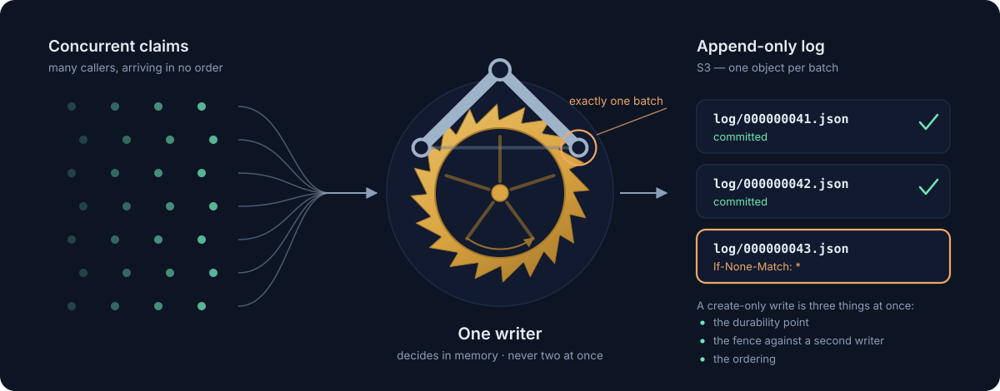

<p align="center">
  
</p>

# Escapement

Single-writer state machines over object storage. Claim a code, consume a quota,
reserve a slot — one at a time, in order, durable before the caller is told yes.
**S3 is the only database.**

Escapement is the sibling of [Memcard](https://github.com/GiganticPlayground/memcard)
and shares its scaffolding: OpenAPI-first routing, `token-weaver` auth, `logra`
logging, `reqcast` analytics, Zod-validated config, node:test.

The full design, with diagrams, is in [docs/ARCHITECTURE.md](docs/ARCHITECTURE.md).

---

## Why "escapement"

An escapement is the part of a mechanical clock that sits between the mainspring
and the hands. The spring pushes constantly and with no sense of order; the
escapement converts that continuous pressure into discrete, counted, irreversible
steps. A pallet fork locks the escape wheel, releases exactly one tooth, and locks
again. The wheel can never run free, and it can never run backwards.

That is precisely the problem this service solves.

Requests arrive continuously and in no order. "Give me the next unclaimed code"
is a decision about the *whole pool*, so it cannot be answered correctly by two
processes at once — a second writer hands the same code to a second person. So
Escapement does what the clock does: one writer, one batch released at a time, in
order, and never backwards. Each release is made permanent by a single
create-only write to S3, which is simultaneously the durability point, the fence
against a second writer, and the ordering.

The name sits at the mechanism level, not the use-case level: `pool` and `quota`
are state machines, and Escapement is the thing that releases them.

---

## What this is for, and what it isn't

Use Escapement when a decision depends on a fact that **spans entities**:

- the next unclaimed code from a finite pool
- a cap across all users, or per user, that must never be exceeded
- a reservation that must not be double-issued
- a unique-name registry, a monotonic sequence, a job lease

Use Memcard instead when each entity's state is **independent** — one save file
per player, no cross-player invariants. Memcard is stateless, scales to any
number of instances, and needs no coordination, because it never has to know
anything about the other keys. That is the whole line between them:

|  | Memcard | Escapement |
|---|---|---|
| unit of state | one object per player | one log per deployment |
| concurrency | optimistic, per key (ETag) | serialized, single writer |
| scaling | horizontal, no coordination | one writer + warm standbys |
| can express | "this player's save" | "only 5,000 of these exist" |
| reads | S3 GET per request | in memory, no S3 call |

Do **not** reach for Escapement when state won't fit in RAM, when you need range
queries or secondary indexes, when write volume exceeds a few thousand per
second, or for blobs. Those are the boundaries that keep this a small correct
thing rather than a bad database.

---

## Quick start

```bash
npm install
cp .env.example .env          # set AWS_REGION, ESCAPEMENT_S3_BUCKET, ESCAPEMENT_ENV, JWT_*
npm run dev
```

Seed a pool and claim from it:

```bash
# admin credential required
curl -X POST localhost:3000/v1/escapement/admin/pools/launch-codes/seed \
  -H "Authorization: Bearer $ADMIN_TOKEN" \
  -H 'Idempotency-Key: seed-2026-08-19' \
  -H 'Content-Type: application/json' \
  -d '{"codes":["ALPHA-1","ALPHA-2","ALPHA-3"]}'

# any authenticated player
curl -X POST localhost:3000/v1/escapement/pools/launch-codes/claims \
  -H "Authorization: Bearer $TOKEN" \
  -H 'Idempotency-Key: 6f1c…-player-request-id' \
  -H 'Content-Type: application/json' -d '{}'
# → {"pool":"launch-codes","code":"ALPHA-3","by":"player-42","claimedAt":"…"}
```

Interactive docs at `/api-docs`.

---

## API

Every mutation is a **POST**. `PUT`, `PATCH` and `DELETE` are deliberately
unused: CDN and WAF layers routinely reject them by default, and enabling one is
an infrastructure change rather than a code change. Shaping the API so none is
ever needed avoids that dependency entirely.

| Method | Path | Notes |
|---|---|---|
| `GET` | `/health` | 200 once the node has a role |
| `GET` | `/v1/escapement/admin/engine` | role, committed seq, registered machines (admin — it maps cluster topology) |
| `POST` | `/v1/escapement/admin/pools/{pool}/seed` | add codes (admin) |
| `GET` | `/v1/escapement/pools/{pool}` | remaining / claimed / total |
| `POST` | `/v1/escapement/pools/{pool}/claims` | claim the next available code |
| `POST` | `/v1/escapement/pools/{pool}/claims/{code}` | claim one specific code |
| `GET` | `/v1/escapement/pools/{pool}/claims/{code}` | who holds it |
| `POST` | `/v1/escapement/admin/pools/{pool}/releases` | return a code (admin) |
| `POST` | `/v1/escapement/admin/quotas/{quota}` | define a ceiling (admin) |
| `GET` | `/v1/escapement/quotas/{quota}` | definition and usage |
| `POST` | `/v1/escapement/quotas/{quota}/consume` | consume, or `429` |

`Idempotency-Key` is **required** on every mutation. A claim API that burns a
code because the client's network hiccuped is broken in a way users notice, so
the engine records each key's result and replays it rather than acting twice — the
replay is byte-for-byte the original response. Keys are stored scoped to the
authenticated caller and the target machine (`{app}:{userId}:{machine}:{key}`),
so one caller cannot replay another's key and a key used on a pool claim cannot
answer a quota consume. Client-visible semantics are unchanged: retry the same
operation with the same key and the same credential.

Request bodies reject unknown fields, and `ClaimRequest.metadata` is bounded —
at most 32 properties, flat string values up to 1024 characters — because every
claim's metadata lives in memory and in every snapshot for as long as the claim
does. `5xx` responses are deliberately generic; internal error detail goes to
the logs only.

Every request body, response body and error shape is in
[`api/openapi.yaml`](api/openapi.yaml), and
[docs/ARCHITECTURE.md §8](docs/ARCHITECTURE.md#8-the-state-machines-that-ship)
walks through both state machines endpoint by endpoint: what each one does, what
it answers with, and which status each failure gets.

---

## How it works

**Reads never touch S3.** In-memory state is authoritative for decisions, so
`GET` endpoints answer in microseconds — on followers too. S3 is a durability
log, not a lookup store.

**Writes are group-committed.** When commits are already running back to back
the leader holds a `BATCH_WINDOW_MS` window collecting concurrent commands and
writes them as one object; an isolated claim on a quiet node skips the window
entirely. One S3 PUT costs 50–100ms,
so naive one-write-per-claim caps you near 10–20 claims/sec; batching moves the
ceiling into the low thousands and degrades gracefully — at low volume a batch is
just one claim.

**One conditional write does three jobs.** Each batch is `PUT log/<seq>.json`
with `If-None-Match: *`:

1. **Durability** — the caller is told yes only after this returns 200.
2. **Fencing** — if a second node ever believes it is the leader, only one can
   create sequence 43. The loser gets 412, knows with certainty it has been
   fenced, and exits rather than issuing codes it cannot commit.
3. **Ordering** — sequence numbers come from the log, not from a clock.

**Ambiguity is decidable.** A 412 and a network timeout get the *same* treatment:
read the key back and compare the batch's UUID. That collapses "did my write
land?" and "have I been fenced?" into one GET. If the outcome still cannot be
determined, the process exits — returning the codes to the pool risks
double-issuing them, and rejecting the callers risks losing codes that actually
committed, so failing closed and rebuilding from the log is the only safe move.

**Every committed batch is followed by one leadership check.** `If-None-Match`
only fences a slot that still exists, and compaction deletes log keys — so a
writer paused long enough for a successor to commit past its sequence *and*
prune it could re-create the slot invisibly and double-issue. After the PUT
lands, the leader GETs the lease and refuses to answer its callers unless it
still holds it; a commit therefore costs one PUT plus one GET (roughly an 8%
add). The commit itself is durable either way, so callers rejected here retry
against the next leader and are answered from the idempotency record, never
re-issued.

**Nothing decided in a batch is answered before the batch is durable.** In-batch
idempotency-key collisions, immediate results and machine rejections may all
have been decided against provisional state from earlier commands in the same
batch, so they settle only after the append lands — a fenced batch turns every
one of them into a retryable 503. The single exception is a replay of an
already-durable idempotency record, which is safe to answer before the PUT.

**The batch window does not delay a quiet node.** The leader holds the door open
`BATCH_WINDOW_MS` to collect concurrent commands into one PUT, but only when it
is already committing back to back. The first claim after an idle stretch commits
straight away, so a low-traffic deployment pays one S3 round trip rather than a
round trip plus the window.

**Tailing costs one GET.** A follower finds the head of the log by asking for
`seq + 1` and stopping at the first 404, rather than listing the log — sequence
numbers are dense, so the listing added nothing and S3 charges LIST at the write
rate. It reads the lease before trying to take it, for the same reason: failed
conditional writes are billed like successful ones, so probing with a PUT that is
expected to fail was paying write prices for "no". An idle two-node cluster is a
couple of GETs a second.

**Recovery** is the newest snapshot plus the log entries after it. Compaction
runs every `SNAPSHOT_EVERY` commits and prunes what it supersedes, so a cold
start is a couple of GETs rather than full history. It keeps `PRUNE_RETAIN`
entries behind the snapshot, because followers GET-walk the log one sequence at
a time and never LIST it — the margin keeps a prune from deleting the very entry
a lagging follower is about to walk into. A follower that falls behind the
horizon anyway detects it via the lease's committed-`seq` hint and exits to
rebuild rather than replaying over the gap — a gap it ignored would leave the
node silently diverged. Compaction also stands down entirely while
history names a state machine this build does not register, so an old binary
cannot snapshot that machine out of existence and then prune the log that
recorded it.

### Failure semantics

| Event | Result |
|---|---|
| crash before the PUT lands | nothing acked; codes return to the pool on restart |
| crash after the PUT lands | client retries the same key and gets the same code |
| two writers somehow live | the second is fenced on its first commit and restarts as a follower |
| PUT outcome unknown | process exits; state is rebuilt from the log |
| graceful stop | lease verified as this node's, then released; standby is promoted in ~300–500ms |
| hard kill / node loss | standby promoted within `LEASE_TTL_MS` |

---

## State machines

Everything the service does is a `StateMachine` plugged into the one engine.
Adding a capability is a file in `src/machines/`, two lines in
`src/services/index.ts`, and its operations in `api/openapi.yaml` — no engine
changes.

```ts
interface StateMachine<S, C, E, R> {
  readonly name: string;
  init(): S;
  decide(state: S, command: C): Decision<E, R>;  // pure; must not mutate
  apply(state: S, event: E): S;                  // deterministic; may mutate
  snapshot(state: S): Json;
  restore(raw: Json): S;
}
```

`decide` inspects state and returns events to persist, an immediate result, or a
rejection — it runs *before* durability, so nothing it returns is true yet.
`apply` is the only thing that changes state, and it runs identically on a live
commit and during replay. `apply` may mutate in place (which matters when the
state is a 100k-entry pool) because the engine has no rollback path: a commit
whose outcome is unknown exits the process, and the log is the truth.

Two ship today. `pool` is claim-once allocation; `quota` is counters with a
ceiling, present to prove the interface generalizes past allocation. See
[docs/state-machines.md](docs/state-machines.md) to write a third.

---

## Running a warm standby

`docker-stack.yml` deploys two replicas under Swarm. One holds the lease and
writes; the other tails the log so its state is warm, serves reads locally, and
forwards mutations over the overlay network.

```bash
TAG=latest-main docker stack deploy -c docker-stack.yml escapement
```

CI publishes `:<git-tag>` on tags and `:latest-main` on `main`; `TAG` selects
which image the stack runs (defaulting to `latest-main`).

**The standby reports healthy on purpose.** The intuitive design — "the standby
fails its health check so the routing mesh keeps traffic off it" — breaks:
orchestrators restart unhealthy tasks, so a permanently-unhealthy standby
crash-loops forever. Traffic steering belongs in the application. Peers find each
other by the endpoint recorded in `lease.json`, set from
`ESCAPEMENT_ENDPOINT_HOST={{.Task.Name}}`.

Other settings that matter, and why:

- `max_replicas_per_node: 1` — otherwise Swarm can put both replicas on one node
  and there is no standby at all.
- `order: stop-first` — the replacement task never races the outgoing leader for
  the lease.
- `stop_grace_period` > `DRAIN_TIMEOUT_MS` — the leader drains in-flight commits
  and *deletes* the lease, so failover is ~300–500ms (the standby notices on its
  next `FOLLOW_POLL_MS` poll) instead of the full TTL. The delete is verified:
  the leader reads the lease first and deletes only if it is still its own, so a
  drain that outlives the TTL cannot delete a new leader's lease.
- `restart_policy: any` — a fenced leader exits 1 deliberately. Swarm restarts
  it and it rejoins as a follower. That is the self-healing path, not an error.

The lease is an optimisation, not the safety mechanism. It only stops two nodes
from wasting effort fighting; correctness comes from the log's conditional write,
so a takeover that guesses wrong about liveness still cannot issue anything twice.
Renewal is conditional on the etag of the lease this node last wrote: a 412 means
a peer took over while this node was paused, and it exits to rejoin as a follower
rather than stealing the lease back and serving arbitrarily stale reads.

A follower forwards mutations with a timeout of `LEASE_TTL_MS` — the failover
horizon. If the leader is stuck, a replacement exists within one TTL, so waiting
longer only pins the client.

---

## Operations

### IAM and bucket bootstrap

The service needs `s3:GetObject`, `s3:PutObject` and `s3:DeleteObject` on
`<prefix>/*`, plus `s3:ListBucket` — LIST is used only for snapshot discovery at
boot and leader-side pruning, never on the steady-state path. The bucket needs
nothing special beyond conditional-write support, which standard S3 has and
MinIO provides. A fresh deployment needs only the bucket and the env vars: the
log starts empty.

### Monitoring

The log lines worth alerting on:

| Line | Meaning |
|---|---|
| `fatal` | the node is exiting — normal during failover, but a loop means trouble |
| `skipping compaction — history names unregistered machines` | a rollback is in progress; the log grows until the machine is registered again |
| `follower poll failed` (repeated) | a silently stalled follower serving increasingly stale reads — see the failure mode in `docs/HANDOFF.md` |
| `lease renew failed` | transient S3 trouble on the renewal path; the commit fence still holds |
| `compaction failed` | harmless in itself — the log is still complete — but recovery slows until one succeeds |

### Error codes

| Code | Status | Retryable |
|---|---|---|
| `NO_LEADER` | 503 | yes — after `retryAfterMs` |
| `LEADER_UNREACHABLE` | 503 | yes — forwarding timed out or failed; a replacement leader exists within one `LEASE_TTL_MS` |
| `UPSTREAM_UNAVAILABLE` | 503 | yes — the node could not safely answer (draining, fenced batch, unconfirmed leadership) |
| `POOL_EXHAUSTED` | 409 | no — the pool exists and is empty |
| `ALREADY_CLAIMED` | 409 | no — someone else holds that code |
| `QUOTA_EXCEEDED` | 429 | no — until usage resets or the limit is raised |

Retries of a mutation must reuse the same `Idempotency-Key`; that is what makes
every 503 above safe to retry.

### Snapshot growth

The service never prunes snapshots. Put an S3 lifecycle rule on
`<prefix>/<env>/snapshot/` expiring objects older than a comfortable window —
safe because only the newest snapshot is ever read, and the log retains
`PRUNE_RETAIN` entries behind it.

### Local development

`docker-compose.yml` includes no S3. Local runs need MinIO or the repo's stub —
`node tests/integration/fake-s3-standalone.mjs` serves one on port 9541 — with
`ESCAPEMENT_S3_ENDPOINT` pointed at it.

---

## Configuration

Validated by Zod at import — the process fails fast rather than at the first
request that needs a missing value. Full list in `.env.example`.

| Variable | Default | Notes |
|---|---|---|
| `AWS_REGION` | — | required |
| `ESCAPEMENT_S3_BUCKET` | — | required |
| `ESCAPEMENT_ENV` | — | required; becomes a key segment |
| `ESCAPEMENT_KEY_PREFIX` | `escapement` | becomes a key segment |
| `ESCAPEMENT_ENDPOINT_HOST` | hostname | how peers reach this node |
| `BATCH_WINDOW_MS` | `50` | group commit window |
| `MAX_BATCH` | `500` | commands per S3 write |
| `LEASE_TTL_MS` | `15000` | worst-case failover on a hard kill |
| `FOLLOW_POLL_MS` | `1000` | follower tail interval |
| `SNAPSHOT_EVERY` | `1000` | commits between snapshots |
| `PRUNE_RETAIN` | `200` | log entries kept behind a snapshot for lagging followers |
| `IDEMPOTENCY_LIMIT` | `50000` | retry window, in records |
| `DRAIN_TIMEOUT_MS` | `10000` | time allowed for in-flight commits to drain on shutdown |
| `SHUTDOWN_TIMEOUT_MS` | `30000` | hard ceiling on the whole shutdown sequence |
| `ESCAPEMENT_S3_ENDPOINT` | — | point at MinIO or the stub for local runs |
| `ESCAPEMENT_CONFIG_PATH` | — | auth strategy file |
| `REQCAST_CONFIG` | — | analytics; off when absent |

Auth strategies — one per kind of caller — live in that file. Players present a
JWT and are identified by its `sub`; a server-side service that cannot mint one
presents a `static` shared secret instead. A static token carries no claims, so
it says which of two shapes it is: `admin: true` for the admin routes (the target
comes from the URL), or a `service: { app, actor }` block for the normal ones,
which supplies the identity the token cannot — used exactly where a JWT strategy
uses its app claim and `sub`, so the caller's idempotency keys stay scoped to it
rather than collapsing into the shared anonymous namespace. The two are
independent, and at most one static strategy may be configured. See
[`config/escapement.yaml.example`](config/escapement.yaml.example) and
[docs/ARCHITECTURE.md §9](docs/ARCHITECTURE.md#9-authentication-and-authorization).

The `JWT_*` group is the no-config-file fallback: when a config file supplies
the auth strategies (`ESCAPEMENT_CONFIG_PATH`, or `config/escapement.yaml` when
it exists), `JWT_ISSUER`/`JWKS_URI`/`JWT_SECRET` are not required.
`JWT_AUDIENCE` is strongly recommended either way — a JWT strategy that verifies
no audience accepts tokens the same issuer minted for a *different* service, and
each such strategy logs a warning at startup.

Bucket layout:

```
<prefix>/<env>/log/000000000042.json     one object per committed batch
<prefix>/<env>/snapshot/000000001000.json
<prefix>/<env>/lease.json                current leader (advisory)
```

---

## Development

```bash
npm run validate       # type-check + lint + format:check
npm test               # unit suite (node:test)
npm run test:failover  # two nodes against a stub S3: election, forwarding, failover
npm run gen-types      # regenerate src/types/schema.d.ts after editing the spec
npm run gen-controllers
```

CI gates the image: the Docker publish workflow runs `validate`, the unit
suite and the failover suite before anything is built or pushed — nothing is
published untested.

Routing is OpenAPI-driven. `api/openapi.yaml` is the source of truth: it
validates every request and dispatches to a controller by
`x-eov-operation-handler` (the file in `src/controllers/`) and
`x-eov-operation-id` (the exported function). There is no router file — to add an
endpoint, add it to the spec and create the matching export.

## License

MIT
