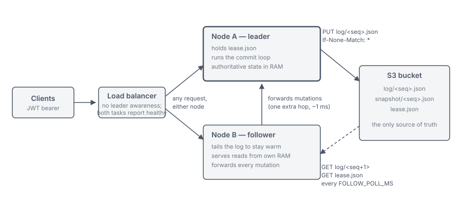
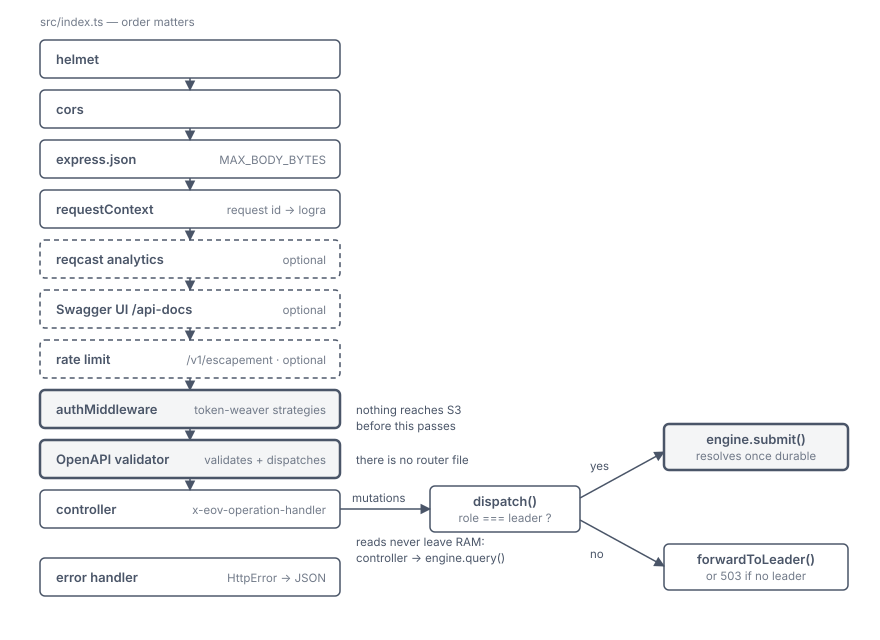
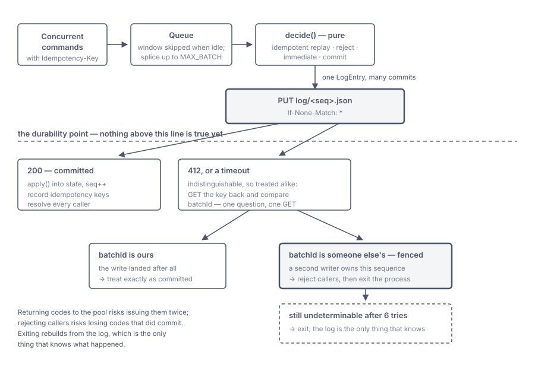
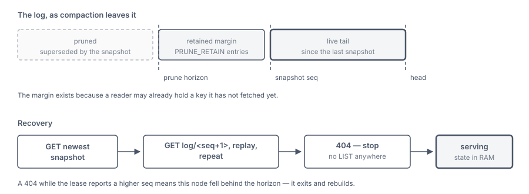
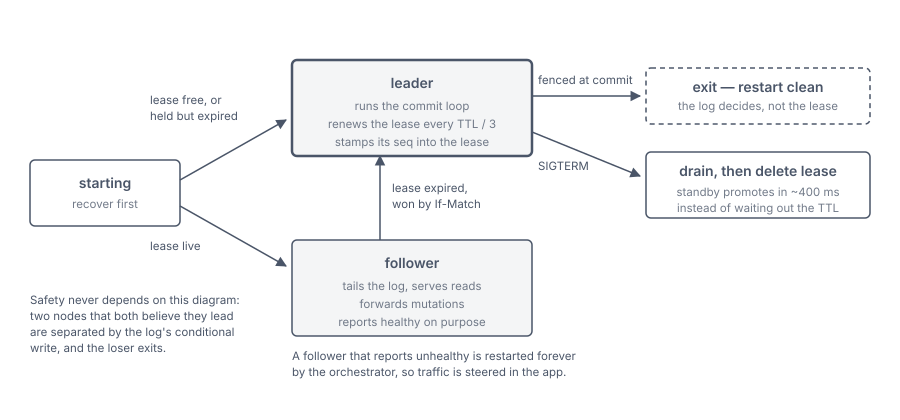

# Architecture

Escapement is a single-writer replicated state machine whose log lives in S3.
Every mutation is serialized through one writer, committed to an append-only log
of objects using conditional writes, and answered only once it is durable. Reads
are served from memory and never touch S3.

This document is the whole design. `README.md` is the usage-level tour,
`docs/state-machines.md` is the guide to adding a machine, and `docs/HANDOFF.md`
records decisions and open items.

---

## Contents

1. [What it is, and the boundary](#1-what-it-is-and-the-boundary)
2. [System overview](#2-system-overview)
3. [Request lifecycle](#3-request-lifecycle)
4. [The engine](#4-the-engine)
5. [Durability and fencing](#5-durability-and-fencing)
6. [Storage, recovery and compaction](#6-storage-recovery-and-compaction)
7. [Roles, the lease and failover](#7-roles-the-lease-and-failover)
8. [The state machines that ship](#8-the-state-machines-that-ship)
9. [Authentication and authorization](#9-authentication-and-authorization)
10. [Configuration](#10-configuration)
11. [Failure semantics](#11-failure-semantics)
12. [Operational characteristics](#12-operational-characteristics)
13. [Deployment](#13-deployment)
14. [Testing strategy](#14-testing-strategy)
15. [Extending it](#15-extending-it)
16. [Known limits and non-goals](#16-known-limits-and-non-goals)

---

## 1. What it is, and the boundary

Some decisions cannot be made correctly by two processes at once. "Give me the
next unclaimed code" is a statement about the *whole pool*: two writers answering
it concurrently hand the same code to two people. Escapement exists for exactly
that class of decision.

**Use it when a decision spans entities:** the next unclaimed code from a finite
pool, a cap that must never be exceeded, a reservation that must not be
double-issued, a unique-name registry, a monotonic sequence, a job lease.

**Use [Memcard](https://github.com/GiganticPlayground/memcard) when each entity's
state is independent:** one save file per player, no cross-player invariant.
Memcard scales horizontally precisely because it never needs to know about the
other keys.

That line decides where a new feature belongs, and it is the only architectural
question this project asks of a newcomer.

Three properties follow from the premise and explain nearly every decision below:

- **S3 is the only database.** No Postgres, no DynamoDB, no Redis. Durability,
  ordering and mutual exclusion all come from one primitive — the conditional
  write.
- **All state fits in memory.** Decisions are made against in-RAM state in
  microseconds; the only slow part of a mutation is proving it durable.
- **Ambiguity is fatal.** Any situation where the engine cannot determine what
  happened exits the process, because rebuilding from the log is the only way to
  learn the truth.

---

## 2. System overview



Every node runs the same image and accepts every request. Exactly one holds the
lease and does all the writing; the others tail the log, answer reads from their
own memory, and forward mutations to the leader.

The load balancer is deliberately leader-unaware. Steering traffic by failing the
standby's health check is the obvious design and it is wrong: orchestrators
restart unhealthy tasks, so a permanently-unhealthy standby crash-loops forever.
Routing therefore happens inside the application, in
[`src/services/forwarder.ts`](../src/services/forwarder.ts), and **followers
report healthy on purpose**.

| Module | Responsibility |
|---|---|
| `src/index.ts` | Express assembly, middleware order, lifecycle |
| `src/middlewares/` | Security headers, request context, auth, OpenAPI validation, errors |
| `src/controllers/` | Thin HTTP handlers; mutations call `dispatch()`, reads call `engine.query()` |
| `src/services/` | Engine + log store singletons, `dispatch()`, leader forwarding |
| `src/engine/engine.ts` | Group commit, idempotency, replay, roles, compaction |
| `src/engine/log-store.ts` | The only module that talks to S3 |
| `src/machines/` | The state machines (`pool`, `quota`) |
| `src/config/` | Zod-validated environment, deployment auth config |

**The singletons are pinned to global symbols.** `src/services/index.ts` stores
the engine and log store on `Symbol.for(...)` keys, because
express-openapi-validator loads controllers from disk at request time and can
instantiate this module a second time in a different module registry. Without the
pin, the HTTP layer talks to an engine that never elected itself: the node reports
`starting` forever while the log says it became leader. This was a real bug, found
by the failover suite and invisible to the unit tests.

---

## 3. Request lifecycle



**Routing is OpenAPI-driven.** There is no router file.
[`api/openapi.yaml`](../api/openapi.yaml) validates every request and dispatches
to a controller by `x-eov-operation-handler` (a file in `src/controllers/`) and
`x-eov-operation-id` (an exported function). Adding an endpoint means editing the
spec, not wiring a route.

**Every mutation is a POST.** `PUT`, `PATCH` and `DELETE` are unused on purpose:
CDN and WAF layers routinely reject them by default, and enabling one at the edge
is an infrastructure change rather than a code change. The API is shaped so that
none is ever needed. Do not add an endpoint that requires one.

**Every mutation carries an `Idempotency-Key`**, required by the spec, so the
validator rejects a request without one before any code runs.

Mutations converge on a single function,
[`dispatch()`](../src/services/dispatch.ts):

```
role === 'leader'  →  engine.submit(command)   // resolves once durable
role !== 'leader'  →  forwardToLeader(req, res)
```

Forwarded requests carry `x-escapement-forwarded-by`. A node that receives a
forwarded request but is not the leader returns `503` rather than forwarding
again, so a stale view cannot produce a loop. When no leader is known — or the
lease names this node — the caller gets `503 NO_LEADER` with a `retryAfterMs`.
The forward itself times out after `LEASE_TTL_MS`: that is the failover horizon,
so if the leader is stuck a replacement exists within one TTL, and waiting
longer only pins the client — it also keeps the 503's `retryAfterMs` honest.

`dispatch()` also scopes the idempotency key before the engine sees it: the
stored key is `{app}:{userId}:{machine}:{clientKey}`, never the raw header
alone. A raw key is a single global namespace — one caller reusing (or guessing)
another's key would be handed the other caller's stored result, and a key first
used on a pool claim would answer a quota consume. A follower forwards the raw
header and the leader re-derives the same scope from the forwarded credential;
client-visible semantics are unchanged: retry the same operation with the same
key and the same credential.

Reads never leave the process: the controller calls `engine.query()`, which runs a
pure function over in-memory state. This is why reads work on followers, and why
they cost nothing.

---

## 4. The engine

### The state machine contract

```ts
interface StateMachine<S, C, E, R> {
  readonly name: string;   // appears in the log; renaming invalidates history
  init(): S;
  decide(state: S, command: C): Decision<E, R>;
  apply(state: S, event: E): S;
  snapshot(state: S): Json;
  restore(raw: Json): S;
}
```

`decide` returns one of three things:

| Decision | Meaning |
|---|---|
| `{ kind: 'commit', events, result }` | persist, then answer |
| `{ kind: 'immediate', result }` | no state change, no S3 write |
| `{ kind: 'reject', status, message }` | no state change, error to the caller |

Two rules make the whole thing work:

**`decide` must not mutate.** It runs before durability, so nothing it returns is
true yet. If the commit fails, the state it inspected must be unchanged. Peeking
at the next free code is fine; popping it is not — that belongs in `apply`.

**`apply` must be deterministic and total.** It runs identically on a live commit
and during replay, and it must never throw, because an event in the log already
happened. Validation belongs in `decide`.

`apply` **may** mutate its argument and return the same reference. That is
deliberate — it avoids copying a 100k-entry pool per event — and it is safe only
because the engine has no rollback path. If an in-memory rollback is ever added,
this has to change with it.

### Group commit

The leader runs one loop. It drains the queue, decides every command against
in-memory state, and writes the whole batch as a single S3 object. A batch of 400
concurrent claims costs one PUT.

The batch window (`BATCH_WINDOW_MS`) is **skipped for the first commit after an
idle stretch**. A window only merges requests when a second one arrives inside it,
so below roughly `1000 / BATCH_WINDOW_MS` commands per second it batches nothing
and simply adds its full length to every caller's latency. Above that rate the
in-flight PUT already does the merging, because anything arriving during a commit
lands in the queue and rides the next batch. Waiting is therefore only worth it
when commits are already running back to back — exactly when the queue is
non-empty at the top of the loop.

### Idempotency

Idempotency is the engine's job, not the machine's. Machines never see an
idempotency key.

- Keys arrive already scoped to the caller and machine by `dispatch()` — see §3.
- A repeated key replays the original result without touching S3. This is the
  **only** answer given before durability — the record it replays already
  committed.
- Two commands sharing a key **inside one batch** collapse to one, settled only
  once the batch is durable.
- Records are kept in memory and written into every snapshot, so a retry survives
  a restart.
- The store is insertion-ordered and bounded by `IDEMPOTENCY_LIMIT`, evicting
  oldest first. A retry arriving after more than that many intervening commits
  gets a fresh claim rather than its original.

### Timestamps

Generated in the **controller** and passed in the command, so `decide` stays pure
and testable, and so replay reproduces the original value rather than the
replay-time clock.

---

## 5. Durability and fencing



Everything rests on one primitive. `If-None-Match: *` creates a key only if it
does not exist; `If-Match: <etag>` replaces one only if it has not changed. Those
two headers provide the durability point, the fence against a second writer, and
the ordering — all at once.

**The durability point is the PUT.** No caller is told anything before
`append()` reports `committed`. A crash before that loses only work nobody was
promised.

**A 412 and a timeout are handled identically**, which is the neatest part of the
design. Both mean "I do not know what happened", and both are answered by reading
the key back and comparing `batchId`. One GET resolves two questions at once: did
my write land, and have I been fenced?

- `batchId` matches → the write landed; proceed as committed.
- `batchId` differs → another writer owns this sequence; this node is fenced.
- Key absent → it never landed; retry the same sequence.

**Fencing is fatal by design.** A fenced writer rejects its in-flight callers and
exits. So does a commit whose outcome is still undeterminable after six attempts.
The alternatives are both worse: returning the codes to the pool risks issuing
them twice, and rejecting the callers risks losing codes that actually committed.
Exiting rebuilds from the log, which is the only thing that knows.

**Every committed batch is followed by one leadership confirmation.**
`If-None-Match` only fences a slot that still exists, and compaction deletes log
keys. A writer paused long enough for a successor to commit past its sequence
*and* prune it would find the slot free, re-create it invisibly — recovery
starts at a newer snapshot and never reads it — and double-issue. So after the
PUT lands, the leader GETs the lease (`confirmLeadership`) and refuses to answer
its callers unless it still holds it. A commit therefore costs one PUT plus one
GET — roughly an 8% add on the PUT the batch already paid for. The confirmation
fails closed: the commit *is* durable, so callers rejected here retry against
the next leader and are answered from the idempotency record, never re-issued.

**Nothing decided in a batch is answered before the batch is durable.** In-batch
idempotency-key collisions, immediate results and machine rejections may all
have been decided against provisional state an earlier command in the same batch
changed, so all of them settle only after the append lands. A fenced batch turns
every one of them into a retryable 503, because the state they were decided
against never committed. Only replays of already-durable idempotency records are
answered before the PUT.

---

## 6. Storage, recovery and compaction



### Key layout

```
<ESCAPEMENT_KEY_PREFIX>/<ESCAPEMENT_ENV>/
  lease.json                     who is writing, and how far it had got
  snapshot/000000001000.json     full state, every SNAPSHOT_EVERY commits
  log/000000001001.json          one batch per key
```

Sequence numbers are zero-padded to 12 digits so a lexicographic listing is also
numeric order. `ESCAPEMENT_KEY_PREFIX` and `ESCAPEMENT_ENV` pass through
`keyPathVar()`, which rejects anything that could silently relocate the log — a
wrong prefix does not fail, it starts an empty history, so the resolved log key is
printed once at startup.

### Recovery

Load the newest snapshot — found by one LIST of the `snapshot/` prefix at boot
(`readLatestSnapshot`), the only listing recovery does — then walk the log
forward one entry at a time — `seq + 1`, `seq + 2` — stopping at the first key
that is not there. **Recovery never lists the log**, and neither does a
follower's tail.

That is partly a cost decision: sequence numbers are dense, so a LIST reveals
nothing a GET would not, and S3 prices LIST at the write rate. It is also strictly
safer. A LIST reports the keys that exist, so a node lagging behind the prune
horizon saw the pruned range simply missing and replayed straight over the gap,
applying later events onto state that never saw the earlier ones — with `seq`
ending at the head, so nothing downstream could tell. Stepping one at a time
cannot skip.

A 404 is ambiguous on its own: end of the log, or a hole compaction left behind?
The lease carries the leader's committed `seq` for exactly this. If a 404 arrives
while the lease reports a higher sequence, this node has fallen behind the prune
horizon, which cannot be repaired in place — it exits and rebuilds.

### Compaction

Every `SNAPSHOT_EVERY` commits, the leader writes a full snapshot and then prunes
the log behind it. The ordering matters: snapshot first, delete second, so a crash
in between leaves only redundant entries that replay harmlessly.

Two rules keep compaction from destroying anything:

**It keeps `PRUNE_RETAIN` entries behind the snapshot.** A follower GET-walks the
log one sequence at a time, so pruning to the head lets a delete land on the very
entry a lagging follower is about to walk into. The retained margin keeps
anything a follower could plausibly still need fetchable — it must comfortably
exceed the commits a follower can miss in one `FOLLOW_POLL_MS` — and a follower
that falls behind the horizon anyway detects it via the lease's committed-`seq`
hint and exits to rebuild. The margin makes the race rare; the exit makes it
loud.

**It refuses to run while history names a machine this build does not register.**
A snapshot is built from the registry, so an older binary would otherwise write a
snapshot without that machine and then prune the log entries that were its last
record — destroying its state permanently, during the very rollback that dropping
unknown machines exists to make survivable. The cost of standing down is an
unbounded log and slower recovery while the old build runs, both visible in the
logs and both self-correcting once the machine is registered again.

---

## 7. Roles, the lease and failover



A node recovers **before** it contends for the lease, so it can never accept a
write without having read the committed history.

The lease is one object holding `{ writerId, endpoint, expiresAt, seq }`.
Acquisition reads before it writes — a follower asks this question on every poll
forever, and the answer is almost always "someone else holds it", which is not
worth paying write prices to hear. The conditional headers still do the fencing;
they are just no longer how the question is asked.

- No lease object → create with `If-None-Match: *`.
- Live lease → stay a follower, note the holder's endpoint and `seq`.
- Expired lease → take it with `If-Match: <etag>`, so two waiting followers cannot
  both win.

The leader renews every `max(1000, LEASE_TTL_MS / 3)` milliseconds — the 1 s
floor matters at the small TTLs quoted below, where a third of the TTL would be
a sub-second heartbeat. Renewal is conditional, `If-Match` on the etag of the
lease this node last wrote: a 412 means a peer replaced the lease while this
node was paused or partitioned, so it is a stale leader with arbitrarily old
state, and it exits to rejoin as a follower rather than stealing the lease back
and serving stale reads. Any *other* renewal failure is logged and swallowed on
purpose: the log's conditional write still fences, so a transient S3 blip should
not tear down a healthy leader.

**The lease is an optimisation, not the safety mechanism.** It stops two nodes
wasting effort fighting over the writer role. If a follower promotes while the old
leader is merely slow, both believe they lead — and the first commit separates
them, because the loser's `If-None-Match` fails and it exits. Do not "harden" the
lease on the assumption that safety depends on it; tighten the commit path
instead.

Graceful shutdown drains in-flight commands and **deletes** the lease, so a
standby takes over on its next poll rather than waiting out the TTL. The delete
is verified: S3 has no conditional DELETE, so the node reads the lease back and
deletes only if it is still its own — renewal stopped when draining began, so a
drain that outlives the TTL may find a peer already holding the lease, and
deleting *their* lease would force a second, avoidable election. Measured:
~300–500 ms graceful, ~3–4 s after a SIGKILL with a 4 s TTL.

---

## 8. The state machines that ship

Two machines ride the same engine and the same log, and can commit in the same
batch. Both are registered in `src/services/index.ts`; neither knows the other
exists.

Three things are true of every mutation below, so they are not repeated per
endpoint: it is a **POST**, it requires an **`Idempotency-Key`** header, and it
returns **503** on a node that cannot reach a leader. A repeat of the same key
returns the original response byte for byte — a replay is deliberately
indistinguishable from the first answer, because that is what makes a client-side
retry safe.

Reads are served from the answering node's memory. A follower replies as readily
as the leader, and its figures may trail by up to one `FOLLOW_POLL_MS`.

---

### `pool` — claim-once allocation

**The invariant:** every code is issued to at most one caller, ever. The pool has
bounded stock and can run out.

**Why it needs a single writer:** "give me the next unclaimed code" is a question
about the whole pool. Two processes answering it concurrently hand the same code
to two people.

**State:** per pool, a free list plus a map of claims. The free list is an array
with an index (`CodePool`), giving O(1) `takeNext()` *and* O(1) `take(code)` via
swap-remove — redeeming a specific known code is a first-class operation, not an
afterthought. Invariant: `total === remaining + claimed`.

**Codes are issued in reverse seed order**, because `takeNext()` pops the end of
the array. Nothing depends on the order; do not read the sequence as meaningful.

#### `POST /v1/escapement/admin/pools/{pool}/seed` — admin

Adds codes. Creates the pool if it does not exist. Seeding is additive and
idempotent by content: codes already in the pool, or already claimed, are
filtered out, and **a seed that adds nothing performs no S3 write at all**.

| | |
|---|---|
| Body | `{ "codes": ["A", "B"] }` — 1 to 200,000 items, each 1–256 chars |
| `200` | `{ "pool": "launch-codes", "added": 2, "remaining": 2 }` |
| `403` | credential is not marked `admin` in the deployment config |

#### `POST /v1/escapement/pools/{pool}/claims`

Takes the next available code.

| | |
|---|---|
| Body | `{ "by": "...", "metadata": {...} }` — both optional; `by` defaults to the token subject. `metadata` is bounded — at most 32 properties, flat string values up to 1024 chars — because it lives in memory and in every snapshot for as long as the claim does |
| `200` | `{ "pool": "launch-codes", "code": "A", "by": "player-1", "claimedAt": "2026-08-20T12:00:00.000Z" }` |
| `404` | no pool by that name |
| `409` | `{ "message": "...", "code": "POOL_EXHAUSTED" }` — the pool exists and is empty |

`claimedAt` is generated by the controller, not the machine, so it travels in the
event and replay reproduces the original timestamp rather than the replay-time
clock.

#### `POST /v1/escapement/pools/{pool}/claims/{code}`

Claims one specific code — redemption of a code the caller already holds.

| | |
|---|---|
| Body | same as above, optional |
| `200` | same `Claim` shape |
| `404` | no such pool, **or** the code is not in this pool |
| `409` | `{ "message": "...", "code": "ALREADY_CLAIMED" }` — someone took it first |

The two 404 cases are distinguished by the message, not the status: both mean
"there is nothing here to claim".

#### `GET /v1/escapement/pools/{pool}/claims/{code}`

Who holds a code, and when they took it.

| | |
|---|---|
| `200` | `{ "pool": "...", "code": "A", "by": "player-1", "claimedAt": "...", "metadata": {...} }` |
| `404` | the code is not currently claimed — including a code that was released |

#### `GET /v1/escapement/pools/{pool}`

| | |
|---|---|
| `200` | `{ "pool": "launch-codes", "remaining": 1998, "claimed": 2, "total": 2000 }` |
| `404` | no pool by that name |

#### `POST /v1/escapement/admin/pools/{pool}/releases` — admin

Returns a claimed code to the free list, dropping its claim record. An undo path
for a mis-issued code, not a routine operation.

| | |
|---|---|
| Body | `{ "code": "A", "reason": "..." }` — `reason` optional, recorded on the command |
| `200` | `{ "pool": "launch-codes", "code": "A", "remaining": 1999 }` |
| `404` | no such pool, or that code is not currently claimed |

---

### `quota` — counters with a ceiling

**The invariant:** recorded usage never exceeds the limit. Consuming past it is
refused outright rather than clamped, and nothing is partially applied.

**Why it needs a single writer:** the same reason. "Is there room for three more?"
is a question about a shared counter.

**State:** per quota, a limit, a `perSubject` flag, a running total, and — only
when `perSubject` is true — per-subject usage. A whole-quota ceiling deliberately
does *not* record who spent it: nothing enforces that number, and keeping it would
grow the state and every snapshot without bound.

**Two modes, and the difference shows up in the responses:**

- `perSubject: false` — one ceiling for everyone. `used` is the total.
- `perSubject: true` — the ceiling applies to each subject independently. There is
  no whole-quota usage figure, so reads must name a subject.

#### `POST /v1/escapement/admin/quotas/{quota}` — admin

Defines or redefines the ceiling. Redefining **preserves recorded usage**, so
lowering a limit below current usage is allowed and simply leaves the quota
exhausted rather than silently forgiving the spend. An identical redefinition is
recognised and performs no S3 write.

| | |
|---|---|
| Body | `{ "limit": 3, "perSubject": true }` — `limit` >= 0, `perSubject` defaults false |
| `200` | `{ "quota": "daily", "limit": 3, "perSubject": true, "subjects": 0 }` |
| `403` | credential is not marked `admin` |

The response describes the **definition**, not a usage position — deliberately.
For a per-subject quota there is no single used/remaining pair that means
anything, so it is not invented here.

#### `POST /v1/escapement/quotas/{quota}/consume`

| | |
|---|---|
| Body | `{ "subject": "...", "amount": 1 }` — both optional; `subject` defaults to the token subject, `amount` to 1 and must be a positive integer |
| `200` | `{ "quota": "daily", "subject": "player-1", "used": 3, "limit": 3, "remaining": 0 }` |
| `404` | no quota by that name — quotas must be defined before use |
| `429` | `{ "message": "...", "code": "QUOTA_EXCEEDED", "errors": { "used": 2, "limit": 3 } }` — so the caller can see how much room was left. **Nothing is consumed.** |

`used` and `remaining` are scoped the way the quota is: for a per-subject quota
they describe that subject, otherwise the whole quota.

#### `GET /v1/escapement/quotas/{quota}`

| | |
|---|---|
| `200` (whole-quota) | `{ "quota": "total", "limit": 500, "used": 12, "remaining": 488, "perSubject": false, "subjects": 0 }` |
| `200` (per-subject) | `{ "quota": "daily", "limit": 3, "used": 1, "remaining": 2, "perSubject": true, "subject": "player-1", "subjects": 47 }` |
| `400` | a per-subject quota asked about with no subject available |
| `404` | no quota by that name |

For a per-subject quota, `?subject=` names whose usage to report; omit it and the
caller's own identity is used, matching how `consume` picks a subject. The `400`
covers a credential that names no subject — a static service token — which gets a
refusal rather than a figure comparing a total against a per-subject ceiling. In a
deployment where such tokens are not granted the player routes at all, that case
is already answered with a `403` before it reaches the handler; the check stays as
a backstop. `subjects` is the count of distinct subjects with recorded usage.

---

### Engine and health

| Endpoint | Response |
|---|---|
| `GET /health` | `200 {"status":"ok","role":"leader"\|"follower",...}` once the node has a role; `503` while `starting` or draining. **A follower is healthy** — see §7. |
| `GET /v1/escapement/admin/engine` | `{ nodeId, role, seq, endpoint, leaderEndpoint?, queued, draining, machines[] }` — `seq` is the last committed log entry. Admin-only, because it maps internal cluster topology |

## 9. Authentication and authorization

Verification is delegated to `token-weaver/auth`. Escapement supplies the strategy
list, one per kind of caller it accepts, and maps the verified payload onto its
own request shape. Strategies are tried in order, first match wins; when all
reject, the most informative failure is surfaced (`403` beats `401`, because
"authenticated but not allowed here" tells the caller more than "bad token").

Strategies come from a deployment config file (`ESCAPEMENT_CONFIG_PATH`, else
`config/escapement.yaml`). With no file, one strategy is built from the `JWT_*`
environment variables — and only then are `JWT_ISSUER`, `JWKS_URI` or
`JWT_SECRET` required; when a file supplies the strategies, none of the group is
read, so none is demanded. An audience is strongly recommended either way:
without one, verification checks only signature and issuer, so a token the same
issuer minted for a *different* service is accepted here too. Each JWT strategy
that omits an audience logs a warning at startup. Secrets need not live in the file: `${env:VAR}` and
`${file:PATH}` placeholders resolve at startup, and an unset variable or
unreadable file is a hard failure, so such a file is safe to commit beside a
deployment.

Admin routes live under `/v1/escapement/admin` and **deny by default** — a
strategy must be marked `admin: true` to reach them. The privilege is re-checked
next to the code that acts on it, via `requireAdmin(req)`, rather than trusted
from the routing layer alone.

Auth runs before the OpenAPI validator, so nothing reaches S3 before it passes.

---

## 10. Configuration

Validated by Zod at import time (`src/config/env.validation.ts`), so a
misconfigured process fails at startup rather than at the first request.
Cross-field rules are enforced there too — for example `LEASE_TTL_MS` must exceed
`2 × FOLLOW_POLL_MS`, or a follower cannot get two polls inside the window.

| Variable | Default | Notes |
|---|---|---|
| `AWS_REGION` | — | required |
| `ESCAPEMENT_S3_BUCKET` | — | required |
| `ESCAPEMENT_ENV` | — | required; becomes a key segment |
| `ESCAPEMENT_KEY_PREFIX` | `escapement` | becomes a key segment |
| `ESCAPEMENT_ENDPOINT_HOST` | hostname | how peers reach this node |
| `BATCH_WINDOW_MS` | `50` | group-commit window; skipped when idle |
| `MAX_BATCH` | `500` | commands per commit |
| `LEASE_TTL_MS` | `15000` | worst-case failover after a hard kill |
| `FOLLOW_POLL_MS` | `1000` | follower tail + lease check interval |
| `SNAPSHOT_EVERY` | `1000` | commits between snapshots |
| `PRUNE_RETAIN` | `200` | entries kept behind a snapshot for in-flight readers |
| `IDEMPOTENCY_LIMIT` | `50000` | window in which a retry is safe |
| `DRAIN_TIMEOUT_MS` | `10000` | time allowed for in-flight commits to drain on shutdown |
| `SHUTDOWN_TIMEOUT_MS` | `30000` | hard ceiling on the whole shutdown sequence |
| `ESCAPEMENT_CONFIG_PATH` | — | auth strategy file; when present, the `JWT_*` group is not required |
| `ESCAPEMENT_S3_ENDPOINT` | — | point at MinIO or a stub for local runs |

**`BATCH_WINDOW_MS` and `PRUNE_RETAIN` are coupled.** The retained margin is
denominated in entries, not time, so it must cover the commits a follower can miss
between polls:

```
entries per poll ≈ FOLLOW_POLL_MS / (BATCH_WINDOW_MS + PUT latency)
```

Defaults give ~20 against a retain of 200 — 10× headroom. Below a ~5 ms window the
margin needs raising to match.

---

## 11. Failure semantics

| Event | Result |
|---|---|
| Commit succeeds | callers answered; only now is anything true |
| Commit returns 412, `batchId` matches | the write landed; treated as committed |
| Commit returns 412, `batchId` differs | fenced → callers get retryable 503s, exit |
| Commit lands but the lease is another node's | callers get retryable 503s, exit; retries replay from the idempotency record |
| Commit outcome unknown after retries | exit; the log is the only source of truth |
| GET-walk hits a 404 while the lease reports a higher seq | behind the prune horizon → exit and rebuild |
| Snapshot or prune fails | logged and ignored; the log is still complete |
| Lease renewal 412s | a peer holds the lease → exit and rejoin as a follower |
| Lease renewal fails otherwise | logged and ignored; the commit path still fences |
| Leader killed | standby promotes within the lease TTL |
| Leader stopped gracefully | lease released; standby promotes in ~400 ms |
| History names an unregistered machine | compaction stands down; log grows; nothing lost |
| Machine `apply` throws during replay | leader fails to boot; a follower stalls silently |

`5xx` responses are deliberately generic — internal error detail goes to the
logs only, never to the caller.

---

## 12. Operational characteristics

### Latency

A claim costs one S3 round trip. The batch window is not on the path of an
isolated request, so a quiet deployment sees round-trip latency alone, and a busy
one amortises many claims across one PUT.

### Memory

Measured against the real `pool` machine with 100,000 codes:

| Codes | Pool state | `snapshot()` + `JSON.stringify` | Serialized size |
|---|---|---|---|
| 100k | 0% claimed | 1.6 ms | 1.34 MB |
| 100k | 50% claimed | 6.3 ms | 4.57 MB |
| 100k | 100% claimed | 11.7 ms | 7.81 MB |
| 1M | 0% claimed | 19.0 ms | 13.35 MB |
| 1M | 50% claimed | 119.3 ms | 46.15 MB |
| 1M | 100% claimed | 156.4 ms | 79.05 MB |

Heap: **54 MB for 100k codes** and **493 MB for 1M**, fully claimed — on *every*
node, since followers hold the same state. Claim records dominate the snapshot
(~78 bytes each), not the codes themselves.

Size scales linearly with the pool. Serialization does not quite: 10x the codes
cost 13x the time, and it is synchronous, so it blocks the commit loop for its
whole duration.

Note that `snapshot()` and `JSON.stringify` are synchronous, so compaction blocks
the commit loop for that duration. Fine at 100k; ~120 ms at 1M, which would be a
visible stall.

### Cost

S3 request pricing dominates, and it is driven by polling rather than by traffic —
each batch is a single PUT plus the post-commit lease GET (an ~8% add) no matter
how many claims ride it. Failed conditional requests are billed at normal rates,
and LIST is billed at the PUT rate, which is why neither appears on the
follower's steady-state path.

Measured on the stub against two live nodes, idle: **3 s → 14 GET, 2 PUT, 0 LIST**
— the writes being lease renewals. At US-East-1 list prices that is roughly $2/month
per follower plus ~$2.60/month for the leader's lease renewals.

Storage is negligible by comparison: a few hundred small log objects, plus
snapshots. Snapshots are never pruned by the service, which is a growth vector
in principle and pennies in practice — an S3 lifecycle rule on the `snapshot/`
prefix caps it (see the worked example below).

### A worked example: 10 million codes, 30 million claims

At small volumes the bill is all polling and none of it is work. Scale the pool
and that inverts. Assume 10M codes seeded, 30M claim requests over one month, of
which 10M succeed — the rest being rejections once the pool runs dry, plus
idempotent retries.

**Only some requests write anything.** A `reject` or `immediate` decision is
answered from memory, and a batch whose `commits` array ends up empty does no PUT
at all. So the 20M requests that do not claim a code cost **nothing** in S3.
Exhaustion is free; so is a client hammering a retry.

**The 10M that do commit turn into PUTs at a rate set by batching**, and batch
size is roughly `arrival rate x (BATCH_WINDOW_MS + PUT round trip)`:

| Claim rate | Claims per batch | PUTs for 10M | PUT cost |
|---|---|---|---|
| 4/s — spread evenly over the month | ~1 | ~10M | ~$50 |
| 10/s — concentrated in 300 operating hours | ~1 | ~10M | ~$50 |
| 200/s — a peak hour | ~16 | ~0.6M | ~$3 |

The uncomfortable line is the middle one. At ten claims a second the 50 ms window
merges almost nothing, so you pay close to one PUT per claim. `BATCH_WINDOW_MS` is
the lever, and at this volume it is worth real money:

| Window at 10 claims/s | Claims per batch | PUTs | PUT cost |
|---|---|---|---|
| 50 ms | ~1 | 10M | ~$50 |
| 250 ms | ~2.8 | 3.6M | ~$18 |
| 1000 ms | ~10 | 1M | ~$5 |

Follower polling stays at roughly $2/month throughout — at this scale it is a
rounding error rather than the whole bill.

**Snapshots stop being free.** 10M commits at `SNAPSHOT_EVERY=1000` is 10,000
snapshots, and each one is the entire state. Extrapolating the 1M measurements,
a 10M-code snapshot is on the order of **790 MB**. Nothing prunes them, so a month
of operation accumulates several terabytes — plausibly **$50-90 in the first month
and rising every month after**, which overtakes the request bill. Retaining only
the last few snapshots turns that back into pennies, and it is the single
highest-value change at this scale. The interim mitigation needs no code: an S3
lifecycle rule on `<prefix>/<env>/snapshot/` expiring objects older than a
comfortable window is safe today, because only the newest snapshot is ever read
and the log retains `PRUNE_RETAIN` entries behind it.

**What actually breaks first is not cost.** Extrapolated to 10M codes: ~4.5 GB of
heap on every node, and a synchronous snapshot taking on the order of two seconds
— which stalls the commit loop, at ten claims a second, roughly every hundred
seconds. Seeding is one ~134 MB log object. Long before the bill becomes the
problem, the "state fits comfortably in memory" premise stops holding, and the
answer is to shard the pool across writers rather than to tune anything here.

**More pools do not change any of this.** Cost tracks total codes and total
commits, not how they are divided: every pool shares one engine, one log and one
snapshot. Splitting 10M codes into a hundred pools of 100k changes nothing.
Splitting them across *writers*, each with its own key prefix and a disjoint set
of codes, divides all of it — which is why sharding is the scaling story and pool
count is not.

---

## 13. Deployment

A Docker Swarm stack ships in `docker-stack.yml`: two replicas of one image, both
live and healthy, exactly one holding the lease.

Peers address each other by Swarm task name on the overlay network
(`ESCAPEMENT_ENDPOINT_HOST={{.Task.Name}}`). Auth config and AWS credentials
arrive as Swarm secrets. CI publishes `:<git-tag>` on tags and `:latest-main`
on `main`; the stack's `TAG` variable selects which, defaulting to
`latest-main`.

The service needs `s3:GetObject`, `s3:PutObject` and `s3:DeleteObject` on
`<prefix>/*`, plus `s3:ListBucket` — used only for snapshot discovery at boot
and leader-side pruning. The bucket needs nothing beyond conditional-write
support (standard S3; MinIO works). A fresh deployment needs only the bucket and
the env vars: the log starts empty. Operational specifics — log lines worth
alerting on, error codes, the snapshot lifecycle rule — live in the README's
Operations section.

A single instance is a legitimate deployment. It costs less and is simpler; what
it gives up is failover and zero-downtime deploys. Note that with no standby the
lease TTL stops bounding failover and starts bounding *restart*: a restarted
process reads a still-valid lease left by its predecessor and returns
`503 NO_LEADER` until it expires.

---

## 14. Testing strategy

**`npm test` — unit, `node:test`.** The machines (decide purity, no double issue,
exhaustion, snapshot round-trip) and the engine against an in-memory log store
that models S3's conditional-write semantics: group commit, idempotency replay,
same-key-in-one-batch, fencing, recovery from log and from snapshot, hole
detection, prune margin, and compaction standing down for unknown machines.

**`npm run test:failover` — integration, not part of `npm test`.** Two real
processes against a stub S3, covering what the unit tests structurally cannot:
election, follower forwarding, read convergence, quota enforcement across nodes,
SIGKILL promotion, graceful hand-off, that no code is issued twice across a
leadership change, and the idle request mix that keeps the cost fixes from
regressing.

The split matters. The global-symbol bug in §2 was invisible to the unit tests and
caught only by running two real processes.

Both suites gate the Docker image: the publish workflow runs `validate`, the
unit suite and the failover suite before anything is built or pushed.

---

## 15. Extending it

Adding a capability touches six files and never the engine:

1. `src/machines/<name>.machine.ts` — the machine, plus pure read helpers.
2. `src/machines/index.ts` — re-export.
3. `src/services/index.ts` — add to the `machines: [...]` array.
4. `api/openapi.yaml` — operations, with `x-eov-operation-handler` and
   `x-eov-operation-id`. Mutations are POST, take a required `Idempotency-Key`,
   and live under `/admin/...` if they should need admin credentials.
5. `src/controllers/<name>Controller.ts` — thin; `dispatch()` for mutations,
   `engine.query()` for reads.
6. `tests/unit/<name>.machine.test.ts` — at minimum: `decide` does not mutate, the
   invariant cannot be violated, rejections carry the right status, and
   snapshot/restore round-trips through JSON.

Before writing one, ask whether the decision genuinely spans entities, and whether
the state fits comfortably in memory. A machine whose state grows without bound
turns a small correct service into a bad database.

`snapshot()` must produce something `JSON.stringify` handles — no `Map`, `Set`,
`Date` or class instances at the leaves — and `restore()` must tolerate a snapshot
written by an older build, treating unknown fields as absent rather than throwing,
or a rollback can never start.

---

## 16. Known limits and non-goals

- **Write throughput is one node's.** Sharding a pool across writers with disjoint
  code sets and separate key prefixes is the only version worth building; a shared
  log with optimistic retry gets *slower* as writers are added. Uneven drain is
  the part that needs design.
- **Replicas add availability, not durability.** S3 is the source of truth. A
  standby buys fast failover and zero-downtime deploys, nothing else.
- **No read-your-writes across nodes.** A follower is up to `FOLLOW_POLL_MS`
  behind, so a client that mutates via the leader and then reads from a follower
  may not see its own write.
- **Idempotency is bounded** by `IDEMPOTENCY_LIMIT` and evicted by age.
- **Seeding writes one large object** — 100k codes is ~1.34 MB in a single log
  entry. S3 is fine with it; a very large pool would be better chunked.
- **Never verified against real S3.** The conditional-write behaviour everything
  depends on is modelled by a stub, and a stub cannot prove AWS agrees.
- **No response validation.** `validateResponses` is off, matching Memcard.
